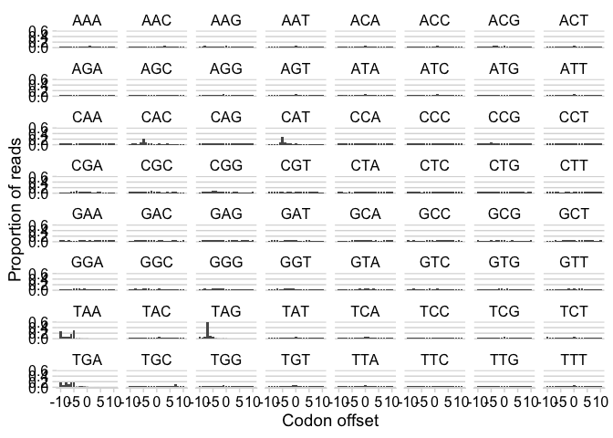

Biological analysis vignettes
================
Jay Hesselberth

## Ribosome footprinting

``` bash
python3 ribo-profiling/rpfs_by_codon.py
```

Illustrates position of the “ribosome shadow” established by ribosomes
stalled at histidine codons in cells starved for histidine and
histidinyl-tRNAs.

``` r
library(tidyverse)
library(cowplot)

tbl <- read_tsv(
  "ribo-profiling/rpfs.iso.tsv.gz",
  col_names = c("codon", "aa", "offset", "signal")
)

tbl
```

    ## # A tibble: 1,324 x 4
    ##    codon aa    offset signal
    ##    <chr> <chr>  <dbl>  <dbl>
    ##  1 TCA   Ser        0  66825
    ##  2 TCA   Ser       -6  46632
    ##  3 TCA   Ser       -3  46056
    ##  4 TCA   Ser       -2  45570
    ##  5 TCA   Ser       -1  46082
    ##  6 TCA   Ser        1  58346
    ##  7 TCA   Ser       -8  33891
    ##  8 TCA   Ser       -7  42053
    ##  9 TCA   Ser       -5  35769
    ## 10 TCA   Ser       -4  44854
    ## # … with 1,314 more rows

### By amino acid

``` r
group_by(tbl, aa) %>%
  mutate(prop.signal = signal / sum(signal)) %>%
  ggplot(aes(offset, prop.signal)) +
    geom_col() +
    facet_wrap(~ aa) + 
    theme_minimal_hgrid() +
    labs(
      x = "Codon offset",
      y = "Proportion of reads"
    )
```

<!-- -->

### By isodecoder

``` r
tbl %>%
  group_by(codon) %>%
  mutate(prop.signal = signal / sum(signal)) %>%
  ggplot(aes(offset, prop.signal)) +
    geom_col() +
    facet_wrap(~ codon) + 
    theme_minimal_hgrid() +
    labs(
      x = "Codon offset",
      y = "Proportion of reads"
    )
```

<!-- -->

### Exercises

1.  Include data from minus strand genes.

2.  Break up by tRNA isodecoder (done, takes a few hours to run)
