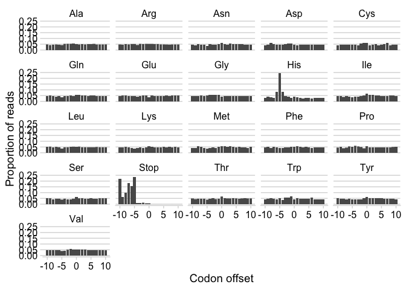

Biological analysis vignettes
================
Jay Hesselberth

## Ribosome footprinting

Illustrates position of the “ribosome shadow” established by ribosomes
stalled at histidine codons in cells starved for histidine and
histidinyl-tRNAs.

``` r
library(tidyverse)
library(cowplot)

tbl <- read_tsv(
  "ribo-profiling/rpfs.tsv.gz",
  col_names = c("codon", "offset", "signal")
) %>%
  group_by(codon) %>%
  mutate(prop.signal = signal / sum(signal))

ggplot(tbl, aes(offset, prop.signal)) +
  geom_col() +
  facet_wrap(~ codon) + 
  theme_minimal_hgrid() +
  labs(
    x = "Codon offset",
    y = "Proportion of reads"
  )
```

<!-- -->
